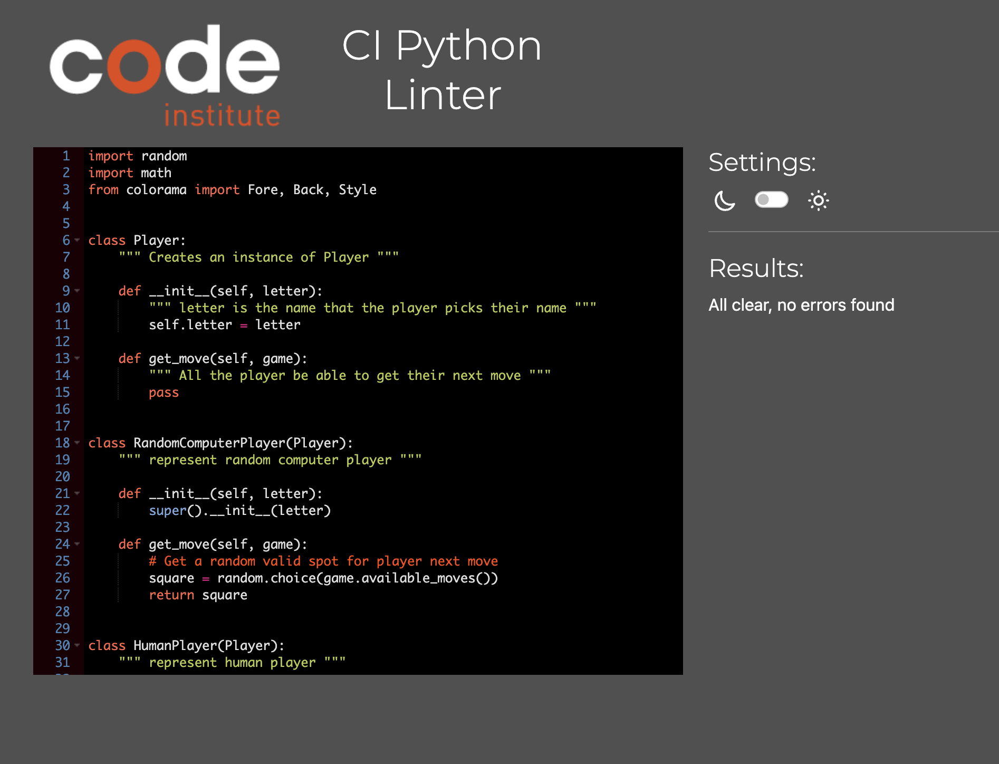

# TicTacToe

The link to TicTacToe 
The TicTacToe is a Python terminal project to foster social interaction development.TicTacToe can be used to promote several cognitive skills, including counting and spatial skills and colour and shape identification. It helps develop essential strategic thinking and planning skills. It serves as a foundation for more complex strategy games and can provide entertainment and mental stimulation for people of all ages. It reinforces basic math skills. While Tic-Tac-Toe is a simple game, it can be a valuable tool for learning. 
Users can quickly learn the game's rules and which side they want to be on. They should continue playing the game or stop after the match ends according to the instructions.[Tic Tac Toe Heroku Link](https://tic-tac-toe-game-by-wanwisa-f2dfdd0abd2a.herokuapp.com/)

## How to play:
Tic-Tac-Toe is a simple game played on a 3x3 grid, and the goal is to be the first to get three of your symbols (either "X" or "O") in a row, either horizontally, vertically, or diagonally. Here are the basic instructions to play Tic-Tac-Toe:
 1. Click this [Tic Tac Toe Heroku Link](https://tic-tac-toe-game-by-wanwisa-f2dfdd0abd2a.herokuapp.com/) or copy this text ****https://tic-tac-toe-game-by-wanwisa-f2dfdd0abd2a.herokuapp.com/**** and paste it into your browser's address bar.
 2. When the page is loaded, click 'RUN PROGRAM'.
 3. Learn the rules.
 4. Two players typically play tic-tac-toe. One player takes "X," and the other takes "O". Pick the side they want to be on according to the instruction
 5. Players take turns placing their symbol (X or O) in any empty grid cell by select the number between 0-8.
 6. Three in a row horizontally (across the top, middle, or bottom row).
Three in a row vertically (along the left, centre, or right column).
Three in a row diagonally (from the top-left to the bottom-right or from the top-right to the bottom-left).
7. The game ends when one player wins by achieving a winning combination. The game ends in a draw, if all cells on the grid are filled and no player has won. In this case, the game is considered a tie. Announcing the Winner: If a player wins, they announce their victory by saying, "X WIN !" or "O WIN !"
8. Playing Again: Human players can choose to stop or continue to play by selecting a simple menu using the arrow up and down to enter Play Again or Quit.

Remember that Tic-Tac-Toe is a game with a limited number of possible moves, and with experienced players, it often ends in a draw.

## User Stories

### First Time Visitor Goals:
  - As a first-time visitor, I want to quickly understand the program's primary purpose so that I can learn more about this program.
  - As a first-time visitor, I want to navigate the program quickly to find clear instructions and content about playing the game.
  - As a first-time visitor, I must provide a well-designed tutorial or onboarding process to ensure new users enjoy the game with clarity.
  - As a first-time visitor, I want to be able to find a straightforward way to initiate their first game and start a new game when the game is over
 - As a first-time visitor, I want to find a helpful program to fulfil my Expectations.
 - As a first-time visitor, I want to see different text colors so I easily read the story.

### Frequent Visitor Goals:
  - As a Frequent User, I want the option to customize the game's settings, such as board size and difficulty level, and pick a side to play to tailor the game to my preferences and challenge myself with different variations. ( Future improvement)

## Features
- When the program is loaded. The user can see a welcome message that engages them to start playing and instructions describing the game and how to play it.
- Underneath the instruction will show the TicTacToe first game board, which has a number 0-8 in each cell and context to tell the user with a side turn and ask the user to put numbers 0-8.

- The user enters the numbers 0-8, and the program will display the game board of the result of two plays between the user(human player) and a random computer player.
- The random computer player will generate to pick the number automatically, then print context to ask the user to add numbers 0-8 again.

- If the user puts the number less than 0, then it will print out a warning that it is an invalid number and tell who turns and puts move(number) again

  

- If the user puts the number greater than 8, then it will print out a warning that it is an invalid number and tell who turns and puts move(number) again

  

- If the user enters the correct number, it will continue to play
  

- Announcing the Winner: If any winning Combinations appear: Here are the eight possible ways to win:
    - Three in a row horizontally (across the top, middle, or bottom row).
     
    - Three in a row vertically (along the left, center, or right column).
     
    - Three in a row diagonally (from the top-left to the bottom-right or from the top-right to the bottom-left).
     
- Announce the winner, either X or O and show the user a simple menu to pick whether they want to play again or not.
  
  

- Announcing the game is tie: If no winning combinations appear.

  

- Ask player to play again by give them simple menu(Play Again and Quit) selecting a simple menu using the arrow up and down to enter Play Again or Quit. 

  

- When the user moves arrow to play again and click enter, the program will load and start again.
  
   

- When the user moves arrow to quit and click enter, the program will announce "Thanks for playing the game Goodbye!!!".
   

## Flowchart
The flowchart represents the logic of the application:

## Technologies Used
  - python3.11.4: used to to anchor the project and direct all application behavior
  - JavaScript: used to provide the start script needed to run the Code Institute mock terminal in the browser
  - HTML: used to construction the elements involved in building the mock terminal in the browser

### Frameworks/Libraries, Programmes and Tools:
### Python module/packages:
  - random was used to implement pseudo-random number generation.
  - math was used to implement the mathematical operations.
  - os was used to clear the terminal before running the program.

### Third-party imports:
  - Simple Terminal Menu was used to implement the menu.
  - Colorama was used to add colors and styles to the project.
  - Simple term menu was use to create simple menu to ask user to play again or quit.

###  OTher Tools:
  - Gitpod was used as the main tool to write and edit code.
  - VSCode was used as the plan and practice tool to write and edit code.
  - Git was used for the version control of the website.
  - GitHub was used to host the code of the website.
  - Excel was used to image a flowchart for the README.md file.
  - Code Institute CI Python Linter was use to check the final code.
  - HeroKu was used to deploy the project.

## CI Python Linter Check:

  ## Bugs
   - Solved bugs 
  The TicTacToe game does not loop because it places the while loop method in the wrong position. The while loop method has been placed in the bottle of the run.py page to make it work.

   - The instruction content displayed the wrong literacy rule, so I have fixed it by using the f-string instead of the escape character
    
   

   

  

## Deployment
  - The program was deployed to [Heroku Link](https://dashboard.heroku.com/apps/tic-tac-toe-game-by-wanwisa/deploy/github)
  - The program can be reached by the link [Link To Play Game](https://tic-tac-toe-game-by-wanwisa-f2dfdd0abd2a.herokuapp.com/)

 ### To deploy the project as an application that can be run locally:
 Note:
  1. This project requires you to have Python and nodeJS installed on your local PC:
    - sudo apt-get install python3
  1. You will also need pip installed to allow the installation of modules the application uses.
    - sudo apt-get install python3-pip
  
Create a local copy of the GitHub repository by following one of the two processes below:
  - Download ZIP file:
    - Go to the GitHub Repo page [GitHub Page Link](https://github.com/Kay13051976/tic-tac-toe)
    - Click the Code button and download the ZIP file containing the project.
    - Extract the Zip file to a location on your PC.
  - Clone the repository:
    - Open a folder on your computer with the terminal.
    - Run the following command
      - https://github.com/Kay13051976/tic-tac-toe.git
  - Alternatively, if using Gitpod, you can click below to create your workspace using this repository
    - [Gitpod Link](https://gitpod.io/new/#https://github.com/Kay13051976/tic-tac-toe)
       i. Install Python module dependencies:
       - Run the command pip install
         - pip3 install colorama
         - Or you can follow the link underneath
           [python package library colorama link](https://pypi.org/project/colorama/)
         - pip3 install simple term menu
         - Or you can follow the link underneath
            [python package library simple term menu link](https://pypi.org/project/simple-term-menu/)

### The app was initially deployed to Heroku

#### To deploy the project to Heroku so it can be run as a remote web application:
  - Clone the repository:
    - Open the folder on your computer with the terminal.
    - Run the following command 
      : git clone https://github.com/Kay13051976/tic-tac-toe.git
    - Run the command git remote set-url origin to set the remote repository location to your repository
    - Push the files to your repository with the following command. 
      : git push 
    - Create a Heroku account if you don't already have one

      here [Heroku](https://signup.heroku.com/)

    - Create a new Heroku application on the following page here 

      [New Heroku App](documentation/heroku_create_new_app.png)

    - Go to the deploy tab:

      

    - Search your GitHub repository name.

      
     
     - Link your GitHub account and connect the application to your created  repository.

       

     - Go to the setting tab.

       

     - Add python and nodejs to buildpacks.

       

     - Go Back to deploy tab.
      

     - Click Deploy Branch.

       
    
     - Wait for the completion of the deployment.

       

     - Then click view to view the game and try.
        

     - Or to check the deployment completion, Get back to the dashboard and select the application name you want to open.

       

     - Click the application name to check how it work.  You will see that application dashboard. Click Open app.

       

    - You will see the welcome first-page display on the screen if everything has been completed.

      

  ## Credits
    - Color formatting: Colorama.
    - Terminal menu: Sample Term Menu.

  ## Acknowledgements

    - I am enormously thankful to my mentor Julia Konovalova, for her guidance and valuable feedback.
    - Code Institute tutor and Slack community members for their support and help.
    - Boat with a python comprehension explanation through the Zoom meeting application.
